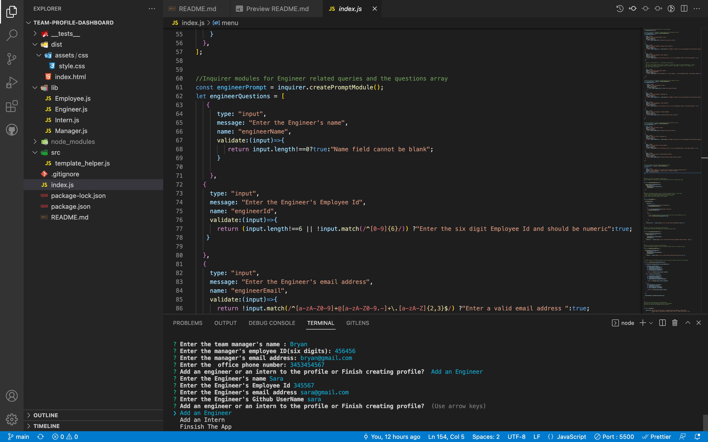
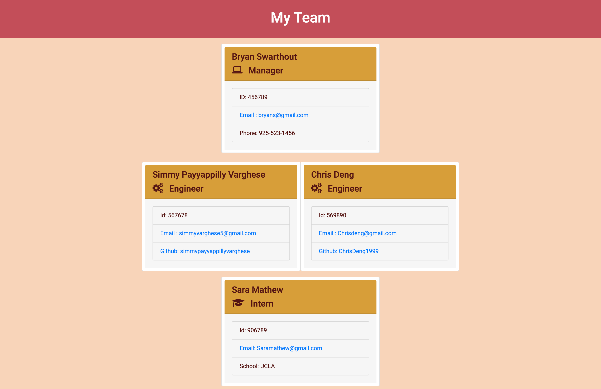

#   TEAM PROFILE DASHBOARD

## PROJECT DESCRIPTION

 

This is a Node JS Command Line Application that make use of the npm package inquirer to collect info on
employees -manager,engineer and interns and build a team profile.User gets a choice to add engineer,intern 
or finish the profile.Once the info is entered an HTML page with Bootstrap styling is created and using 
package fs the colledcted team member info is written into the HTML page.

 

### User Story

AS A manager I WANT to generate a webpage that displays my team's basic info
SO THAT I have quick access to their emails and GitHub profile

 

###  Acceptance Criteria

GIVEN a command-line application that accepts user input
* WHEN I am prompted for my team members and their information THEN an HTML file is generated that displays a nicely formatted team roster based on user input
*   WHEN I click on an email address in the HTML THEN my default email program opens and populates the TO field of the email with the address
*   WHEN I click on the GitHub username THEN that GitHub profile opens in a new tab
*   WHEN I start the application THEN I am prompted to enter the team manager’s name, employee ID, email address, and office number
* WHEN I enter the team manager’s name, employee ID, email address, and office number   THEN I am presented with a menu with the option to add an engineer or an intern or to finish building my team
*   WHEN I select the engineer option  THEN I am prompted to enter the engineer’s name, ID, email, and GitHub username, and I am taken back to the menu
*   WHEN I select the intern option THEN I am prompted to enter the intern’s name, ID, email, and school, and I am taken back to the menu
*   WHEN I decide to finish building my team THEN I exit the application, and the HTML is generated

 

### Links

* Video Link : https://www.loom.com/share/3efe747a56b1431d86f58e2aac574647

* Github Repo Link : https://github.com/simmypayyappillyvarghese/team-profile-dashboard

 

### Technologies & Packages Used

* [x] HTML5
* [x] CSS3
* [x] BOOTSTRAP
* [x] NODE.JS
* [x] INQUIRER
* [x] FS

 

### Screenshots

Below is the screenshot of CLI terminal with prompt message:

Below is the screenshot of the HTML page generated

 

### FOLDER STRUCTURE

* __test__ -This will include all the test files for the library classes
* dist     -This will include styles for HTML file and the generated HTML file
* lib      -This will include all the library classes Employee,Manager,Engineer and Intern used by the application
* src      -This will include template_helper.js file which will hold the template string and helper method to create it
* index.js -This will be the starting point of application.

 

### TEST

To run the tests:

* npm install --save-dev jest
* add test:"jest" to the script in package.json
* npm test
